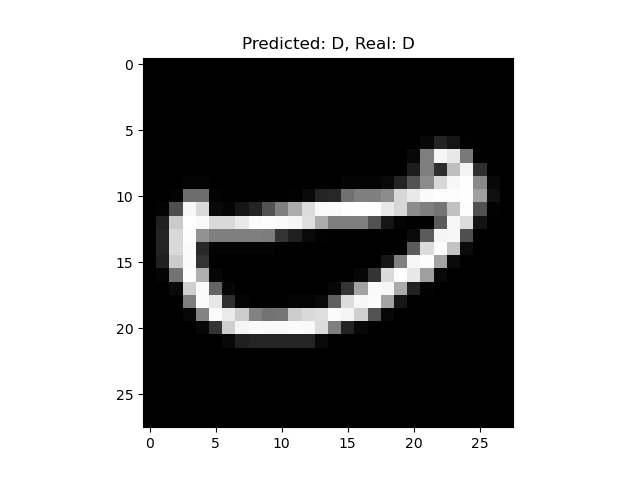
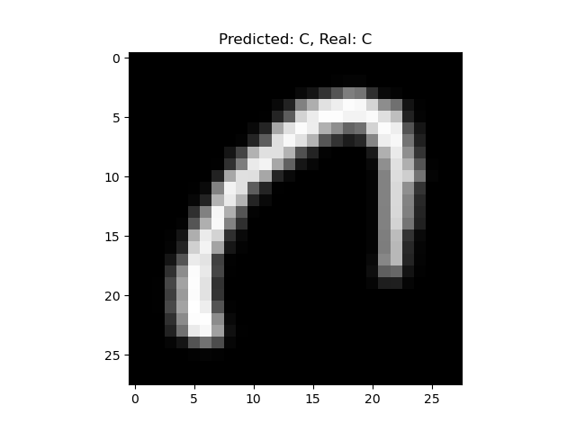

# emnist
Convolutional Neural Network to recognise letters

Simple neural network based on dataset from [https://www.kaggle.com/code/oleksiichornyi/neural-network-emnist/notebook](https://www.kaggle.com/datasets/crawford/emnist)

Example of recognised letters:

